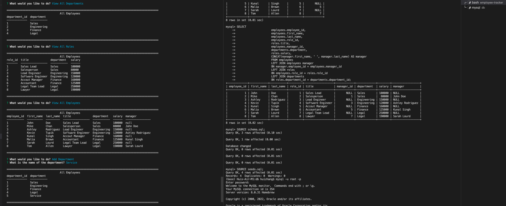
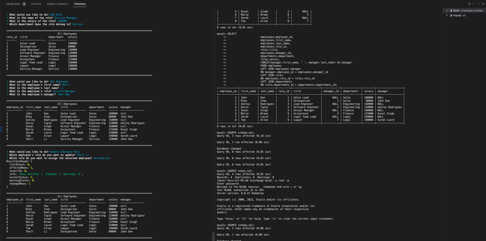
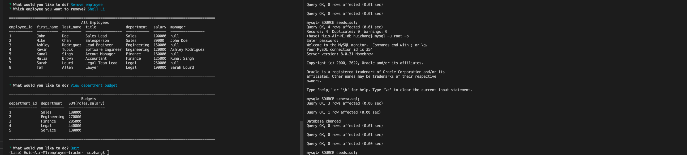

# Employee-Tracker

<p>
    
    
    
    
</p>


## Table of Contents
1. [Description](#description)
2. [User Story](#user-story)
3. [Screenshot](#screenshot)
4. [Video](#video)
5. [Installation](#installation)
6. [License](#license)
7. [Contributing](#contributing)
8. [Test](#test)
9. [Questions](#contact-information)

## Description
Employee-Tracker is a back-end application to manage a company's employee database, using Node.js, inquirer, and MySQL. 

## User Story
```md
AS A business owner
I WANT to be able to view and manage the departments, roles, and employees in my company
SO THAT I can organize and plan my business
```

## Screenshot






## Video
Check out the [walk-through video](https://drive.google.com/file/d/1Nf76T-5lzRhY82wQ1yTtrhEgAozTH50C/view?usp=sharing).

## Installation
To clone the repo:
```
git clone https://github.com/shelldan/employee-tracker.git
``` 
Run 'npm install' to install dependencies

Run 'node index.js' to start the program

---

## License
[](https://opensource.org/licenses/MIT) 

## Contributing 
To contribute to this application, create a pull request.
Here are the steps needed for doing that:
- Fork the repo
- Create a feature branch (git checkout -b NAME-HERE)
- Commit your new feature (git commit -m 'Add some feature')
- Push your branch (git push)
- Create a new Pull Request

Following a code review, your feature will be merged.

---

## Test:
It is recommended that you follow this workflow:

```
GIVEN a command-line application that accepts user input
WHEN I start the application
THEN I am presented with the following options: view all departments, view all roles, view all employees, add a department, add a role, add an employee, and update an employee role
WHEN I choose to view all departments
THEN I am presented with a formatted table showing department names and department ids
WHEN I choose to view all roles
THEN I am presented with the job title, role id, the department that role belongs to, and the salary for that role
WHEN I choose to view all employees
THEN I am presented with a formatted table showing employee data, including employee ids, first names, last names, job titles, departments, salaries, and managers that the employees report to
WHEN I choose to add a department
THEN I am prompted to enter the name of the department and that department is added to the database
WHEN I choose to add a role
THEN I am prompted to enter the name, salary, and department for the role and that role is added to the database
WHEN I choose to add an employee
THEN I am prompted to enter the employee’s first name, last name, role, and manager, and that employee is added to the database
WHEN I choose to update an employee role
THEN I am prompted to select an employee to update and their new role and this information is updated in the database 
WHEN I choose to remove an employee
THEN I am prompted to select an employee to remove
WHEN I choose to view department budget
THEN I am presented with a formatted table showing department id, department name, and salary. 
```

---

## Contact Information
* GitHub Username: [shelldan](https://github.com/shelldan)
